# 🚀 Antigravity AGI — Proto-AGI Framework for Autonomous Software Engineering

<div align="center">


**The most advanced open-source Proto-AGI harness for autonomous software development.**  
Drop it into any project. Your AI assistant becomes a self-healing, self-learning, token-efficient engineering agent.

[Quick Start](#quick-start) · [Architecture](#architecture) · [CLI Reference](#cli-reference) · [IDE Integration](#ide-integration) · [Phases](#cognitive-phases)

</div>

---

## What Makes This Different

Most "AI coding" setups are just a system prompt. This is an **operating system for your AI assistant**:

| Feature | Typical AI Setup | Antigravity AGI |
|---|---|---|
| Skill selection | Manual | **Auto-routed** via semantic skill router |
| Past mistake avoidance | None | **RLHF memory** — never repeats errors |
| Token burn | Uncontrolled | **Token Squeezer Guard** blocks wasteful reads |
| Code changes | Hope they work | **Sandboxed** simulation before applying |
| Session learning | Forgotten on close | **Episodic memory** persists across sessions |
| Code quality | Manual review | **Self-Rewrite Engine** auto-proposes improvements |
| Task management | You write TODOs | **AGI Loop** self-discovers and prioritizes work |

---

## Quick Start

```bash
# 1. Clone the repo
git clone https://github.com/your-username/antigravity-agi
cd antigravity-agi

# 2. One-click setup (creates DBs, indexes skills, installs dependencies like rich & customtkinter)
python setup.py

# 3. Choose your workspace:
# OPTION A: Launch the Desktop GUI Dashboard (Premium Tkinter UI)
python gui/guicli.py

# OPTION B: Open the Terminal-based Live AGI Dashboard
python agicli.py

# 4. Run your first AGI-routed task via CLI
python agicli.py run "refactor the auth module to use JWT"
```

> **No API keys required.** Everything runs locally using your existing AI assistant (Cursor, Windsurf, Antigravity IDE, etc.).

---

## Desktop GUI (Antigravity Manager)

Inside `gui/`, we provide `guicli.py` — an ultra-modern Desktop Application built with `customtkinter`. It features:
- **📡 Live IDE Sync Dashboard:** Dynamically shows what you type in the editor and what tools the AGI is running.
- **🚀 Visual Token Budget:** Displays colorful, real-time progress bars for Session and Daily token usage.
- **🛡️ Google Auth integration:** Syncs with your local IDE configurations (like Git or local workspace accounts) to lock usage metrics to your active profile.
- **🎯 Interactive Task Runner:** Type any coding task in the text box, and watch the AGI router execute it, piping logs live to a console screen.

---

## Architecture

### AGI Cognitive Loop


### System Architecture

```mermaid
graph LR
    subgraph CLI["🖥️ agicli.py — Command Center"]
        D[status]
        RN[run task]
        LP[loop]
        TK[tokens]
        SC[scan]
        MM[memory]
        SK[skills]
    end

    subgraph Cognitive["🧠 Cognitive Stack (agents/hooks/bin/)"]
        SR[skill_router.py]
        RL[rlhf_feedback_loop.py]
        EM[episodic_memory.py]
        RE[self_rewrite_engine.py]
        CO[chunk_optimizer.py]
    end

    subgraph Safety["🛡️ Safety & Control"]
        SG[safe_shell_guard.py]
        TS[token_squeezer.py]
        AM[antigravity_manager.py]
        SB[sandbox_runner.py]
    end

    subgraph Persistence["💾 Persistent Storage"]
        SI[(skill-index.json)]
        RD[(rlhf-memory.db)]
        ED[(episodic-memory.db)]
        TL[(token-ledger.json)]
        RP[(rewrite-priorities.json)]
    end

    CLI --> Cognitive
    CLI --> Safety
    Cognitive --> Persistence
    Safety --> Persistence
```



---

## Cognitive Phases

This framework implements **5 cognitive upgrade phases** on top of a base AI assistant:

### Phase 1: 🔀 Dynamic Skill Retrieval
Never load all skills into context. The **Skill Router** semantically matches your task to the top-K relevant skills and loads only those instructions.

```bash
python agicli.py skills "refactor authentication"
# → auto-selects: auto-fix, safe-commit, sandbox-run
```

### Phase 2: 🧬 Self-Evolution
If no skill matches, the **Meta-Agent** synthesizes a new skill from scratch, tests it, and adds it to the index permanently.

### Phase 3: 🧠 Episodic Memory
Before starting: recall similar past experiences. After finishing: store a structured post-mortem. The agent gets smarter with every session.

```bash
python agicli.py memory "fix database connection timeout"
# → RLHF Preflight Report: 2 similar past errors found
#   [RESOLVED] #12 | connection_refused | fix: add retry backoff
```

### Phase 4: 🔬 System-2 Thinking (Critic + Sandbox)
Risky changes are reviewed by the **Critic Agent** and simulated in a **throwaway workspace copy** before touching production code.

### Phase 5: 🎯 Proactive Agency
When idle, the **Goal Generator** scans the codebase for debt, bugs, and missing tests — building a prioritized, approval-gated task queue autonomously.

---

## CLI Reference

```
python agicli.py [command] [options]
```

| Command | Description |
|---|---|
| `(none)` | Open the live AGI dashboard |
| `run "task"` | Route task through full AGI cognitive stack |
| `loop [--iterations N]` | Start continuous self-improvement loop |
| `tokens [--session N] [--daily N] [--unlock]` | Token budget management |
| `scan` | Self-rewrite priority scanner |
| `memory "task"` | RLHF preflight danger report |
| `skills [query]` | List or semantic-search available skills |
| `setup` | Initialize the AGI harness (first-time) |

### Example Workflows

```bash
# Start a complex refactor safely
python agicli.py run "migrate the database layer from SQLite to PostgreSQL"
# → RLHF checks past DB migration errors
# → Routes to: sandbox-run, auto-fix, safe-commit
# → Loads skill instructions into context

# Continuous improvement mode
python agicli.py loop --iterations 5
# → Scans all hook scripts for rewrite priorities
# → Reports health score and token budget
# → Logs discoveries to session memory

# Check if it's safe to start coding
python agicli.py memory "refactor payment module"
# → ⚠️ UNRESOLVED: TypeError in payment_service.py (seen 3x)
#    Fix attempted: check None before calling .amount

# Check token budget before a long session
python agicli.py tokens
# → Session: 12,450 / 100,000 (12.4%) ████░░░░░░
# → Daily:   45,200 / 300,000 (15.1%) █████░░░░░
```

---

## Token Optimization Engine

Antigravity AGI is built with **zero-waste token consumption** as a first-class design principle:

### Token Squeezer Guard
Blocks large file reads before they burn your context window:
- Files > 150 lines without `StartLine/EndLine` → **DENIED**
- Ranges > 200 lines → **DENIED**
- Forces the agent to use `grep` + targeted reads

### Chunk Optimizer
Splits large Python files into AST-level chunks (functions/classes) for surgical edits:

```bash
python agents/hooks/bin/chunk_optimizer.py list path/to/large_file.py
# → Lists 14 functions with token estimates
#   analyze() → 687 tokens  (L169-L241)
#   apply_patch() → 602 tokens (L294-L363)

python agents/hooks/bin/chunk_optimizer.py view large_file.py analyze
# → Returns only the analyze() function code (~150 lines)

python agents/hooks/bin/chunk_optimizer.py replace large_file.py analyze patched_analyze.py
# → Surgically replaces one function. File structure preserved.
```

### Antigravity Token Manager
Tracks token consumption across tools, sessions, and days:

```bash
python agicli.py tokens
# =============================================
#       🚀 ANTIGRAVITY TOKEN MANAGER 🚀        
# =============================================
# Status         : 🟢 ACTIVE
# Session Usage  : 12,450 / 100,000  ████░░░░░░░░░░░░░░░░░░░░░░░░░░ 12.4%
# Daily Usage    : 45,200 / 300,000  █████░░░░░░░░░░░░░░░░░░░░░░░░░ 15.1%
# =============================================
```

---

## IDE Integration

### Cursor / Windsurf
1. Copy the `agents/` folder to your project root
2. In Cursor: `Settings → Rules for AI` → paste contents of `agents/.cursorrules`
3. Your AI assistant now has the full AGI cognitive stack available

### Antigravity IDE (Full Integration)
1. The `agents/hooks/agent-hooks.json` file is auto-detected
2. All hooks fire automatically on every tool use
3. Run `python agicli.py` in a side terminal for the live dashboard

### Any AI Coding Assistant
The `agents/AGENTS.md` file is automatically loaded by most AI assistants that support project context files. This gives your assistant:
- The full skill index (17 skills)
- The cognitive protocol (when and how to use each layer)
- The token optimization rules
- The safety constraints

---

## Folder Structure

```
antigravity-agi/
├── agicli.py                      ← 🖥️  Main CLI command center
├── setup.py                       ← ⚙️  One-click bootstrapper
├── agents/
│   ├── .cursorrules               ← 📋 AI assistant rules (always active)
│   ├── AGENTS.md                  ← 🗺️  System index for AI agents
│   ├── hooks/
│   │   ├── agent-hooks.json       ← ⚡ Hook configuration
│   │   └── bin/
│   │       ├── antigravity_manager.py  ← 🚀 Token budget manager
│   │       ├── chunk_optimizer.py      ← ✂️  AST-based file splitter
│   │       ├── token_squeezer.py       ← 🛡️  Token burn guard
│   │       ├── skill_router.py         ← 🔀 Semantic skill routing
│   │       ├── skill_indexer.py        ← 📚 Skill index builder
│   │       ├── rlhf_feedback_loop.py   ← 🧠 Error memory & RLHF
│   │       ├── episodic_memory.py      ← 💾 Experience ledger
│   │       ├── self_rewrite_engine.py  ← 🔧 Autonomous code optimizer
│   │       ├── sandbox_runner.py       ← 🏖️  Safe execution sandbox
│   │       ├── error_pattern_tracker.py← 🔍 Error pattern detection
│   │       ├── safe_shell_guard.py     ← 🔒 Destructive command blocker
│   │       ├── session_log.py          ← 📝 Session audit log
│   │       └── session_memory_flush.py ← 💫 Memory persistence
│   ├── agent-definitions/         ← 🤖 Specialized sub-agents
│   │   ├── autonomous-agi.md
│   │   ├── critic.md
│   │   ├── goal-generator.md
│   │   ├── meta-agent.md
│   │   └── skill-router.md
│   ├── skills/                    ← ⚡ 17 slash-command skills
│   │   ├── chunk-optimize/
│   │   ├── auto-fix/
│   │   ├── safe-commit/
│   │   ├── sandbox-run/
│   │   └── ...
│   ├── specs/                     ← 📖 System design specs
│   └── logs/                      ← 📊 Runtime data
│       ├── rlhf-memory.db
│       ├── token-ledger.json
│       ├── skill-index.json
│       └── rewrite-priorities.json
└── README.md
```

---

## RLHF — Never Repeat a Mistake

The RLHF (Reinforcement Learning from Human Feedback) module creates a permanent memory of errors and their solutions:

```bash
# Record a solution after fixing a bug
python agents/hooks/bin/rlhf_feedback_loop.py resolve \
  --error-id 7 \
  --solution "The JWT token needs to be refreshed 5 minutes before expiry, not at expiry"

# Check before starting a similar task
python agents/hooks/bin/rlhf_feedback_loop.py preflight "implement JWT refresh"
# → ⚠️ PREFLIGHT DANGER REPORT
#   [✅ RESOLVED] #7 | auth_error | jwt_service.py
#   Fix: Refresh token 5 min before expiry, not at expiry
```

---

## Requirements

- **Python 3.11+** (uses `ast.parse`, `sqlite3`, `pathlib` — all stdlib)
- **`rich`** (optional, for the full dashboard UI): `pip install rich`
- **Git** (for health checks and safe-commit)
- No external AI API needed — works with your IDE's AI assistant

---

## License

Apache 2.0 — free for personal and commercial use.

---

<div align="center">

**Built with 🧠 Antigravity AGI Framework**  
*The most token-efficient, self-learning AI coding harness ever built.*

⭐ Star this repo if it made your AI smarter!

</div>
