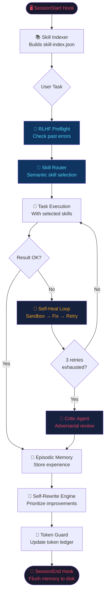
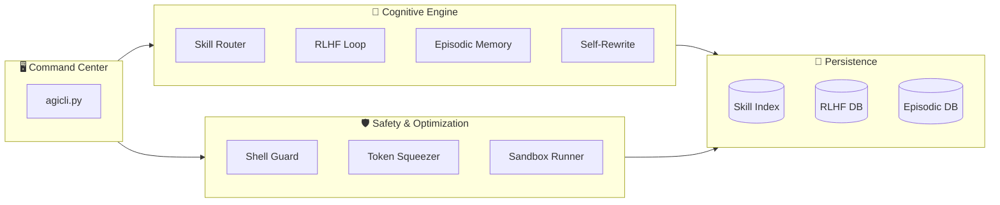

# 🚀 EpisoCodex — Autonomous Engineering Framework

<div align="center">


<br/>

### 💡 **An autonomous AI software engineering framework inspired by and derived from xAI's [grok-build](https://github.com/xai-org/grok-build).**

*Turn your AI coding assistant into a self-healing, self-learning, token-efficient autonomous engineer.*

[Quick Start](#-quick-start) • [Features](#-key-features) • [Architecture](#-architecture) • [CLI Reference](#-cli-reference) • [IDE Integration](#-ide-integration) • [License](#-license)

---

</div>

> [!NOTE]
> ℹ️ **Attribution Notice / یادداشت شفافیت:**
> This repository is built upon the architectural patterns and core execution concepts of xAI's open-source **[grok-build](https://github.com/xai-org/grok-build)** project.

---

## ⚡ What Makes EpisoCodex Different?

Standard AI coding tools rely on static system prompts and unoptimized context windows. **EpisoCodex** brings an Operating System level cognitive harness to your IDE, powered by **grok-build** autonomous concepts.

| Capability | Standard AI Extension | EpisoCodex (Grok-Build Architecture) |
|---|---|---|
| 🔀 **Skill Routing** | Manual & static prompts | **Semantic Skill Router** loads only required tools |
| 🧠 **Error Avoidance** | Repeated trial-and-error | **RLHF Feedback Loop** remembers past mistakes |
| 🛡️ **Token Efficiency** | Burns context rapidly | **Token Squeezer Guard** enforces surgical file reading |
| 🏖️ **Safety & Verification** | Directly mutates codebase | **Sandbox Simulator** verifies code before applying |
| 📝 **Session Persistence** | Context cleared on reset | **Episodic Memory** persists across sessions |
| 🔧 **Code Quality** | Manual refactoring needed | **Self-Rewrite Engine** auto-proposes improvements |

---

## 🚀 Quick Start

### 1. Clone & Setup
```bash
# Clone repository
git clone https://github.com/cleverboy01/EpisoCodex.git
cd EpisoCodex

# Run one-click bootstrapper
python setup.py
```

### 2. Launch Workspace
```bash
# Option A: Modern Desktop GUI Dashboard
python gui/guicli.py

# Option B: Terminal Live AGI Dashboard
python agicli.py
```

### 3. Run Autonomous Task
```bash
python agicli.py run "refactor the authentication module to use JWT"
```

> 💡 **No External API Keys Required:** Runs completely locally using your active IDE assistant (Cursor, Windsurf, Antigravity IDE, etc.).

---

## 🏗️ Architecture

### Cognitive Execution Loop



### System Stack



---

## 🖥️ Desktop GUI (CustomTkinter)

Located inside `gui/guicli.py`, the desktop application offers a clean visual interface for monitoring AI operations:
* 📡 **Live IDE Sync Dashboard:** Real-time stream of active tools and editor state.
* 🚀 **Visual Token Budget:** Real-time session and daily token consumption bars.
* 🛡️ **Workspace Sync:** Aligns memory and tracking to your local workspace account.
* 🎯 **Interactive Task Runner:** Execute tasks directly from a desktop interface.

---

## 🔀 Cognitive Phases

1. **Dynamic Skill Retrieval:** Only loads tools relevant to the current query.
2. **Self-Evolution:** Synthesizes missing skills dynamically when required.
3. **Episodic Memory:** Preflight checks for past errors before writing code.
4. **System-2 Thinking:** Critic review and sandbox isolation for high-risk edits.
5. **Proactive Agency:** Autonomously scans workspace for technical debt when idle.

---

## 📖 CLI Reference

| Command | Description |
|---|---|
| `python agicli.py` | Open interactive terminal dashboard |
| `python agicli.py run "<task>"` | Execute task through full cognitive loop |
| `python agicli.py loop [--iterations N]` | Start continuous self-improvement loop |
| `python agicli.py tokens` | Display current token budget ledger |
| `python agicli.py scan` | Run codebase health & rewrite scan |
| `python agicli.py memory "<task>"` | Perform RLHF preflight error check |

---

## 🛠️ IDE Integration

* **Cursor / Windsurf:** Copy `agents/` folder into your project root and import `agents/.cursorrules`.
* **Antigravity IDE:** Automatic hook detection via `agents/hooks/agent-hooks.json`.

---

## 📜 Acknowledgments & License

This project incorporates architectural concepts and code patterns adapted from xAI's open-source **[grok-build](https://github.com/xai-org/grok-build)** project.

Distributed under the **Apache 2.0 License**.

---

<div align="center">

**Built with 🧠 EpisoCodex (Inspired by xAI's grok-build)**  
⭐ Star this repository if you find it helpful!

</div>
