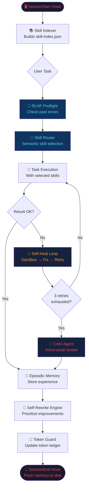

# 🚀 اپیزوکدکس (EpisoCodex) — فریم‌ورک مهندسی خودگردان Grok Build

<div align="center">


<br/>

### 💡 **فریم‌ورک هوشمند توسعه نرم‌افزار، الهام گرفته شده و برگرفته از کدهای پروژه [grok-build](https://github.com/xai-org/grok-build) شرکت xAI.**

*دستیار برنامه‌نویسی خود را با قابلیت‌های Grok Build به یک مهندس خود‌درمان، خودآموز و فوق‌العاده بهینه تبدیل کنید.*

[شروع سریع](#-شروع-سریع) • [معماری Grok Build](#-معماری-grok-build) • [ویژگی‌ها](#-ویژگی‌های-کلیدی) • [دستورات CLI](#-مرجع-دستورات-cli) • [کلمات کلیدی و سئو](#-کلمات-کلیدی-و-سئو) • [لایسنس](#-لایسنس)

---

</div>

> [!NOTE]
> ℹ️ **یادداشت شفافیت / Attribution Notice:**  
> پروژه **EpisoCodex** یک توسعه و ارتقای متن‌باز برگرفته از معماری و کدهای اصلی **[xAI grok-build](https://github.com/xai-org/grok-build)** می‌باشد.

---

## 🔍 معرفی: مهندسی خودگردان با معماری Grok Build

**EpisoCodex (Grok Build Engine)** قدرت عوامل خودگردان پروژه **grok-build** شرکت xAI را مستقیم به محیط‌های توسعه محلی، Cursor، Windsurf و Antigravity IDE می‌آورد. این فریم‌ورک با هدف مدیریت دقیق مصرف توکن، هماهنگی چندعاملی و حلقه‌های خود‌درمانی طراحی شده است.

### کلمات کلیدی و محورهای اصلی (Keywords & Focus)
* **grok-build** / **grok build**: چارچوب توسعه خودگردان نرم‌افزار و اجرای پروژه‌ها.
* **xAI / Grok AI**: ارکستراسیون عوامل هوشمند، تفکر عمیق سیستم-۲ و اجرای ایزوله در سندباکس.
* **Proto-AGI Coding Harness**: حافظه RLHF خودآموز و بهینه‌سازی کدهای پایتون بر اساس AST.

---

## ⚡ تفاوت اصلی معماری Grok Build چیست؟

ابزارهای معمولی برنامه‌نویسی فقط دستورالعمل‌های متنی ثابت دارند، اما **EpisoCodex** با بهره‌گیری از اصول **grok-build**، یک سیستم‌عامل کامل برای دستیار هوش مصنوعی شما ارائه می‌دهد:

| ویژگی | ابزارهای معمولی هوش مصنوعی | موتور Grok Build (EpisoCodex) |
|---|---|---|
| 🔀 **انتخاب مهارت‌ها** | دستی و پرامپت ثابت | **مسیریابی معنایی** ابزارهای مورد نیاز را لود می‌کند |
| 🧠 **یادگیری از اشتباهات** | تکرار مداوم باگ‌ها | **حلقه RLHF** مانع تکرار اشتباهات گذشته می‌شود |
| 🛡️ **مدیریت مصرف توکن** | مصرف بی‌رویه و گران | **سپر فشرده‌ساز توکن** جلوی خوانش‌های بیهوده را می‌گیرد |
| 🏖️ **تست و ایمنی** | اعمال مستقیم روی کد | **سندباکس شبیه‌سازی** کد را قبل از اعمال تست می‌کند |
| 📝 **پایداری حافظه** | پاک شدن بعد از هر نشست | **حافظه اپیزودیک** تجربیات را حفظ می‌کند |
| 🔧 **بهبود کیفیت کد** | نیازمند بازبینی دستی | **موتور خود‌بازنویسی** کدهای مرده را اصلاح می‌کند |

---

## 🚀 شروع سریع

### ۱. دریافت و راه‌اندازی
```bash
# دریافت مخزن Grok Build
git clone https://github.com/cleverboy01/EpisoCodex.git
cd EpisoCodex

# اجرای نصب‌کننده خودکار
python setup.py
```

### ۲. اجرای محیط کاری
```bash
# اجرای داشبورد دسکتاپ گرافیکی
python gui/guicli.py

# یا اجرای داشبورد زنده ترمینال
python agicli.py
```

### ۳. اجرای یک وظیفه
```bash
python agicli.py run "refactor the auth module using JWT and verify in sandbox"
```

> 💡 **بدون نیاز به کلید API مجزا:** همه چیز به صورت محلی با دستیار ادیتور فعلی شما (Cursor, Windsurf, Antigravity IDE, Claude, Grok, GPT-4) کار می‌کند.

---

## 🏗️ معماری Grok Build

### چرخه شناختی (Cognitive Execution Loop)



---

## 🖥️ محیط گرافیکی دسکتاپ (Grok & Antigravity Manager)

در مسیر `gui/guicli.py` یک برنامه مدرن دسکتاپ قرار دارد که امکانات زیر را ارائه می‌دهد:
* 📡 **داشبورد سینک زنده:** نمایش ابزارهای فعال و وضعیت لحظه‌ای ادیتور.
* 🚀 **مدیریت بصری توکن:** نمایش نوارهای پیشرفت مصرف توکن روزانه و نشست جاری.
* 🛡️ **همگام‌سازی پروفایل:** هماهنگی اطلاعات و حافظه با پروفایل محلی.
* 🎯 **اجراکننده تعاملی:** امکان تایپ وظایف و مشاهده لایو لوگ‌های هوش مصنوعی.

---

## 📖 مرجع دستورات CLI

| دستور | توضیحات |
|---|---|
| `python agicli.py` | باز کردن داشبورد متنی زنده |
| `python agicli.py run "<task>"` | اجرای کامل تسک در چرخه شناختی Grok Build |
| `python agicli.py loop [--iterations N]` | اجرای لوپ خود‌اصلاحی مداوم |
| `python agicli.py tokens` | مشاهده و مدیریت بودجه توکن‌ها |
| `python agicli.py scan` | اسکن کل پروژه برای یافتن نقاط قابل بهبود |
| `python agicli.py memory "<task>"` | بررسی خطاهای گذشته پیش از شروع کار |

---

## 🛠️ ادغام با ادیتورها (Cursor, Windsurf, Antigravity)

* **Cursor / Windsurf:** پوشه `agents/` را در ریشه پروژه کپی کرده و فایل `agents/.cursorrules` را اضافه کنید.
* **Antigravity IDE:** شناسایی خودکار هوک‌ها از طریق `agents/hooks/agent-hooks.json`.

---

## 🔑 کلمات کلیدی و سئو (Keywords & Search Tags)

`grok-build` `grok build` `xai grok` `grok ai` `grok-code` `xai-org/grok-build` `autonomous-agent` `ai-software-engineer` `proto-agi` `cursor-rules` `windsurf-ai` `token-optimization` `rlhf-agent` `self-healing-code` `antigravity-agi` `episocodex`

---

## 📜 قدردانی و لایسنس

این پروژه بر اساس کدهای اصلی و معماری پروژه متن‌باز **[grok-build](https://github.com/xai-org/grok-build)** شرکت xAI توسعه یافته است.

تحت لایسنس **Apache 2.0** منتشر شده و استفاده از آن کاملاً آزاد است.

---

<div align="center">

**توسعه یافته با 🧠 EpisoCodex — قدرت گرفته از معماری grok-build شرکت xAI**  
⭐ اگر این پروژه برایتان مفید بود، به آن ستاره دهید!

</div>
